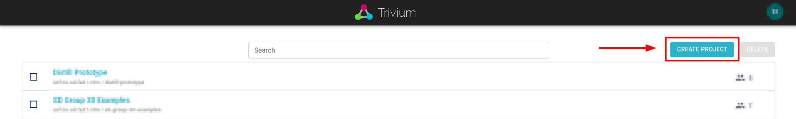
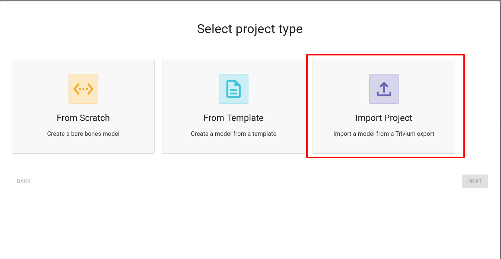

# Gathering Materials

To complete this tutorial, there a couple files needed. First is the sample Nessus scan, which can be downloaded [here](../../assets/sample-scan.nessus).

Additionally, a sample Trivium model needs to be created. To do this, import the sample network diagram (which can be downloaded [here](../../assets/sample-network-diagram.json)) into Trivium.

After you have downloaded the network diagram, login to your Trivium account. From the Projects page, click "Create Project".

In the pop-up window, select "Import Project"

On the next screen, click "Browse..." and upload the JSON file downloaded above. Leave all the other settings as default and click "Create Project". The model should now show up on your Projects page in Trivium.