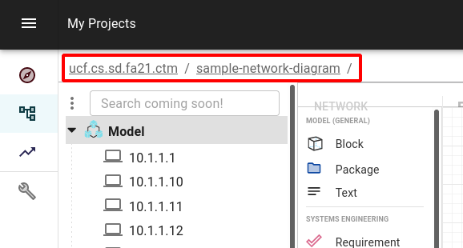
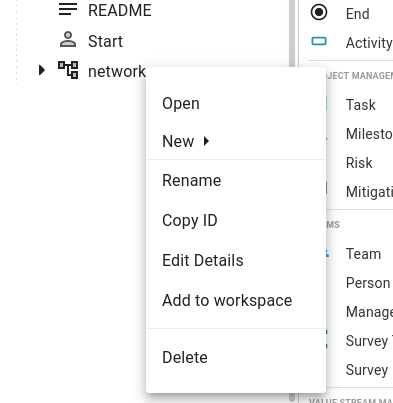

# Running Distill

This section will cover how to use and run the Distill CLI. An explanation of user options as well as the output will be given. Additionally, information on how the Trivium API and Python library were used will be provided.

Make sure you have completed the [Getting Started](../02-Getting%20Started/01-%20Trivium%20CLI.md) sections of this tutorial before proceeding.

## Distill Options

To see the options available, run the following command from the terminal
```
$ distill -h
```

You should see the following output:

```
$ distill -h
usage: distill.py [-h] -m MODEL -d DIAGRAM -n NESSUS [-o OUTPUT]

optional arguments:
  -h, --help            show this help message and exit
  -m MODEL, --model MODEL
                        Model Name
  -d DIAGRAM, --diagram DIAGRAM
                        Diagram Name
  -n NESSUS, --nessus NESSUS
                        Nessus Files
  -o OUTPUT, --output OUTPUT
                        Output File Name
```

The `-m` option takes in the ID of the model in Trivium. To find this, open the model in Trivium. Looking in the upper right corner, there should be two values as follows:



In this case, the model ID would be: `ucf.cs.sd.fa21.ctm:sample-network-diagram`.

The `-d` option takes in the ID of the diagram within that model. To get this ID, right-click on the diagram and select "Copy ID".



In this case, the diagram ID would be `d0db04de-af78-86f3-c952-0590fe949b6578af`.

The `-n` option takes in the path to the Nessus scan. In this instance, that will be `sample-scan.nessus`. 

**NOTE: The above parameters are all *required* when you run Distill**

Finally, the `-o` option allows you to change the name of the output files. If none is provided, it will default to `distill`.

Here is an example of a full `distill` command using the information above (assuming the terminal is in the same folder as the `.nessus` file):

```
$ distill -m ucf.cs.sd.fa21.ctm:sample-network-diagram -d d0db04de-af78-86f3-c952-0590fe949b6578af -n sample-scan.nessus -o tutorial-distill
```

Run the command using the information specific to your imported model and then move onto the next section, [Understanding Output](02-%20Understanding%20Output.md)


