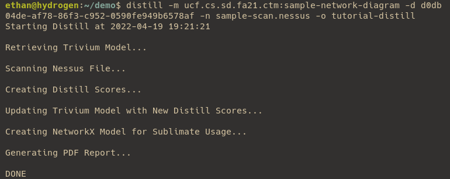
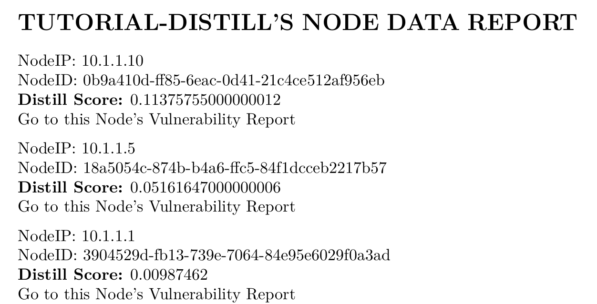

# Understanding Output

After running the command, you should see the following output in the terminal:

There should also be two new files in the folder: `tutorial-distill.json` and `tutorial-distill.pdf`. 

## Distill PDF

The PDF contains a report for every node in the graph, with the IP, Trivium ID, and Distill Score given for each node. In addition, if you click on the `Go to this Node's Vulnerability Report` link, you can see a list of every CVE (which are links to the MITRE CVE database) that was used in the calculation of that node's Distill Score.

## Distill JSON

The JSON file that Distill outputs is a NetworkX graph (NetworkX being a Python library for use with analyzing graph structures) in node-link format that is the input for Sublimate. Part of the design of Distill was to allow for it to be used not only with Sublimate, but have its analysis able to stand on its own or be used with other custom programs. This JSON file is the perfect use for that, as it can easily be read into another Python using NetworkX. Find out more info [here](https://networkx.org/documentation/stable/reference/readwrite/generated/networkx.readwrite.json_graph.node_link_graph.html#networkx.readwrite.json_graph.node_link_graph).

In the final Distill section, we will look [Under the Hood](03-%20Under%20the%20Hood.md) to understand how Distill works with Trivium and Nessus data.