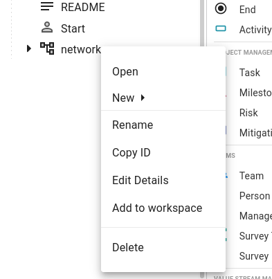

# Running Sublimate

This section will cover how to use and run the Sublimate CLI. An explanation of user options as well as the output will be given. Additionally, information on how the Trivium API and Python library were used will be provided.

Make sure you have completed the [Getting Started](../02-Getting%20Started/01-%20Trivium%20CLI.md) sections of this tutorial before proceeding.

## Sublimate Options

To see the options available, run the following command from the terminal
```
$ sublimate -h
```

You should see the following output:

```
$ sublimate -h
usage: sublimate.py [-h] [-m MODEL] [-d DIAGRAM] -i INPUT -o OUTPUT [-a ATTACKER] [-v VICTIM] [-n NUMBER_PATHS]

optional arguments:
  -h, --help            show this help message and exit
  -m MODEL, --model MODEL
                        Model Name
  -d DIAGRAM, --diagram DIAGRAM
                        Diagram Name
  -i INPUT, --input INPUT
                        Input
  -o OUTPUT, --output OUTPUT
                        Nessus Files
  -a ATTACKER, --attacker ATTACKER
                        Override attacking nodes from diagram
  -v VICTIM, --victim VICTIM
                        Override victim nodes from diagram
  -n NUMBER_PATHS, --number_paths NUMBER_PATHS
                        Quantity of top N paths to display

```

The `-i` parameter takes in the path to the JSON file outputted by Distill. If you've been following this tutorial, the name of that file will be `tutorial-distill.json`.

**NOTE: The above parameter is *required* when you run Sublimate**

In addition to the above parameter you have two options for selecting the Start and End nodes for the Sublimate analysis:

1. Using the `-m` and `-d` parameters, which takes the Start and End node from the Trivium diagram
2. Using the `-a` and `-v` parameters, which takes in an IP for each parameter

### The `-m` and `-d` options

If you look at the imported sample network diagram, you will notice there are two "Actor" objects, one labeled `Start` and one labelled `End`. The node that these are connected to will be the start and end node for the Sublimate analysis, respectively.


You can move these objects around and change where they go to by deleting the connection to a node and adding a new one.

The `-m` option takes in the ID of the model in Trivium. To find this, open the model in Trivium. Looking in the upper right corner, there should be two values as follows:


In this case, the model ID would be: `ucf.cs.sd.fa21.ctm:sample-network-diagram`.

The `-d` option takes in the ID of the diagram within that model. To get this ID, right-click on the diagram and select "Copy ID".



In this case, the diagram ID would be `d0db04de-af78-86f3-c952-0590fe949b6578af`.

### The `-a` and `-v` options

These two options allow you to select the Start and End node on the fly without having to edit the diagram in Trivium.

The `-a` option takes in the IP address of the "Start" node.

The `-v` parameter takes in the IP address of the "End" node.

These two options allow for easy scripting and multiple runs of Sublimate very quickly.

---

The `-n` parameter allows you to limit the number of paths that are outputted by Sublimate. If nothing is provided, it will default to outputting all paths.

Finally, the `-o` option allows you to change the name of the output files, and can be used with either of the two options outlined above. If none is provided, it will default to `sublimate`.

Here are two examples of a full `sublimate` command using the information above (assuming the terminal is in the same folder as the Distill JSON file):

```
$ sublimate -m ucf.cs.sd.fa21.ctm:sample-network-diagram -d d0db04de-af78-86f3-c952-0590fe949b6578af -i tutorial-distill.json -o tutorial-sublimate-1 -n 5

$ sublimate -a 10.1.1.17 -v 10.1.1.10 -i tutorial-distill.json -o tutorial-sublimate-2 -n 5
```

Run the command(s) using the information specific to your imported model and then move onto the next section, [Understanding Output](02-%20Understanding%20Output.md)


