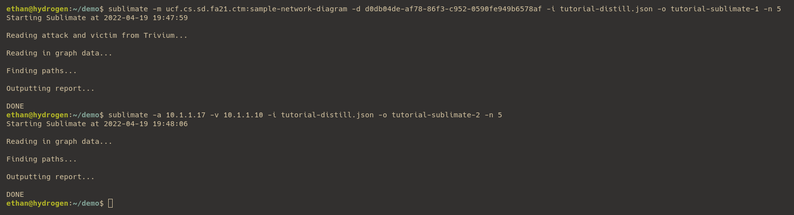
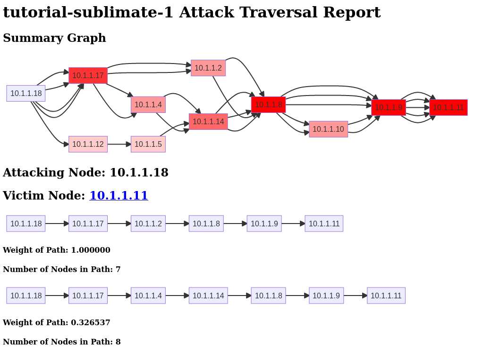

# Understanding Output

After running the command, you should see the following output in the terminal:

Notice that on the second run of Sublimate (which uses the `-a` and `-v` options), the graph is not read from Trivium.

## Sublimate HTML

The HTML report outputted by Sublimate contains multiple graphs: the first, at the very top, is a combined graph of every path contained in the output. This allows for a very visual understanding of the most probable paths in the network. The darker red the color, the more paths that node is contained in. For example, you can see that 10.1.1.8 is contained in every path, so its color is dark red. Every node can also be clicked on to be taken to a CVE report containing every CVE that was used in the analysis.

Under that is a list of the top paths, in order by their weight. Again, every node can be clicked on to brin you to a CVE report.

### Weighting System

The weight of each path is a relative metric based on the max path. For example, the second path with a weight of 0.326537 is about 32.7% the weight of the highest weighted path. The numbers are not intended to be used in relation to different scenarios or different networks, but only to be understoon in relation to the other paths from this specific scenario on this specific network.

In the next section, we will take a look [Under the Hood](03-%20Under%20the%20Hood.md) to see how Sublimate works.